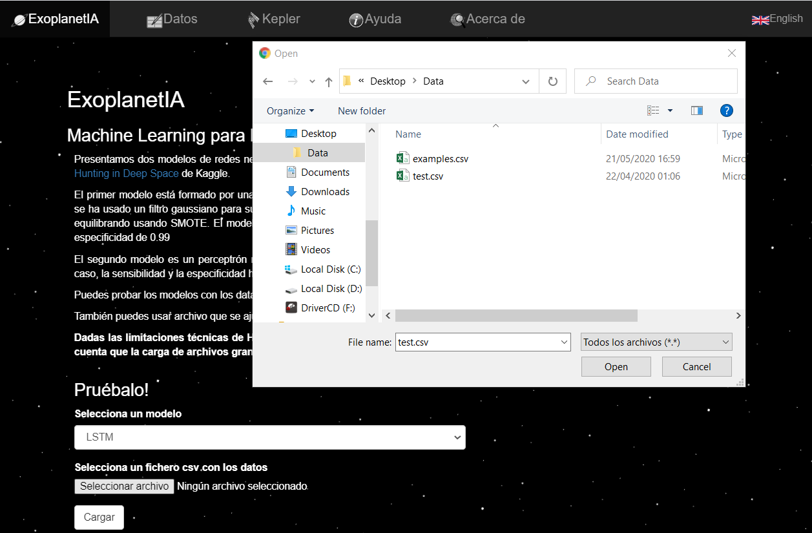
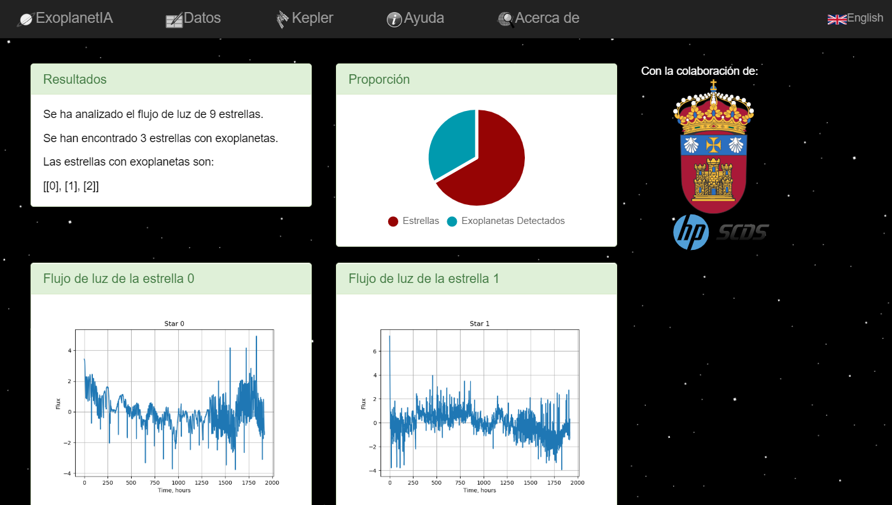

  

# ExoplanetIA: Machine Learning para la detección de exoplanetas

## Descripción

El objetivo de este proyecto es desarrollar una aplicación que, utilizando técnicas de Machine Learning sobre los datos reales ofrecidos por el satélite espacial Kepler, con respecto a la intensidad de luz (flux) registrada durante más de 9 años, y proponer un modelo de red neuronal para detectar exoplanetas por el Método del Tránsito.

## Participantes

- **Alumno UBU**: Jesús María Herruzo Luque
- **Tutor UBU**: Carlos López Nozal
- **Tutores HP**: Manuel Hermán Capitán y Alejandro Viloria Lanero

## Estructura

La información del repositorio se encuentra estructurada en las siguientes carpetas:

*app*: web para testear el modelo final
  - *models*: modelo final para usar en la web
  - *templates*: plantillas html para la web
  - *uploads*: carpeta para almacenar los ficheros de datos cargados en la web
- *documentación*: contiene la documentación del proyecto en formato latex así como en pdf
- *src*: ficheros fuente del proyecto
  - *datos*: ficheros csv con los datos originales
  - *prototipos*: notebooks con los prototipos realizados durante la experimentación 
    - *img*: imagenes de la evolución del score y el loss de cada modelo durante su entrenamiento
    - *saved_models*: modelos guardados durante la experimentación

## Ejecución del modelo

La aplicación puede encontrarse desplegada y lista para usarse en la siguiente dirección:

`https://exoplanetia.herokuapp.com/`

## Ejecución local

Clonar el repositorio:

`git clone https://gitlab.com/HP-SCDS/Observatorio/2019-2020/ubu-exoplanetia.git <directory>`

Instalar los paquetes necesarios definidos en el fichero *requirements.txt* localizado en */src/app/*:

`pip install requirements.txt`

Ejecutar el servidor flask:

`flask run`

Por defecto, el servidor corre en la dirección *http://127.0.0.1:5000/*. El proceso es muy simple, sólo hay que seleccionar el fichero csv que contiene los datos y pulsar el botón *Cargar*.

Una vez procesado, la aplicación nos redirige a la página de resultados, donde podemos ver el número de estrellas con exoplanetas detectadas, así como las gráficas de sus flujos de luz.

